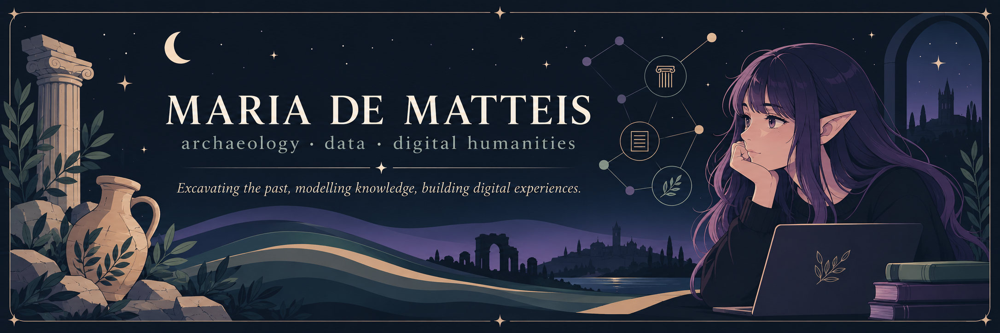

 

### archaeologist · digital humanist · knowledge modeller

*Excavating the past, modelling knowledge, building digital experiences.*

 

---

## ◌ About me

I'm an **archaeologist** currently studying **Digital Humanities and Digital Knowledge** at the University of Bologna.

My interests lie at the intersection of **cultural heritage, data and digital technologies**: from semantic modelling and Linked Open Data to interactive visualisation, web technologies and creative approaches to cultural heritage.

I am particularly interested in how computational methods can be used not only to **describe the past**, but also to connect, interpret and communicate it.

---

## ⟡ Areas of interest

<table>
<tr>
<td width="50%" align="center" valign="top">
<strong>🏺 Digital Cultural Heritage</strong>  
Digital methods for documenting, interpreting and communicating archaeological and cultural heritage.
</td>

<td width="50%" align="center" valign="top">
<strong>◉ Knowledge Representation</strong>  
Ontologies, semantic modelling, knowledge graphs and Linked Open Data for cultural knowledge.
</td>
</tr>

<tr>
<td width="50%" align="center" valign="top">
<strong>◫ Data & Visualisation</strong>  
Data analysis and information visualisation for exploring complex cultural datasets.
</td>

<td width="50%" align="center" valign="top">
<strong>✦ Digital Experiences</strong>  
Interaction design, web interfaces and creative coding for digital humanities projects.
</td>
</tr>
</table>

---

## ⌘ Selected projects

<table>
<tr>
<td width="8%" align="center"><strong>01</strong></td>
<td width="27%">

### [Dark Ontology](https://github.com/SicMundusOrganization/dark-ontology)

</td>
<td>

An OWL ontology modelling identities, temporal manifestations, worlds, relationships and time travel in the TV series *Dark*.

`OWL` `RDF` `SPARQL` `Protégé` `HTML` `CSS`

</td>
</tr>

<tr>
<td align="center"><strong>02</strong></td>
<td>

### [Dear Outsider](https://github.com/IMD-Rewind/DearOutsider)

</td>
<td>

An interactive digital experience designed around the inaccessible Neolithic Grotta dei Cervi in Porto Badisco.

`Digital Heritage` `UX/UI` `Interaction Design` `HTML` `CSS`

</td>
</tr>

<tr>
<td align="center"><strong>03</strong></td>
<td>

### [Apollonian–Dionysian](https://github.com/aiMoirai/Apollonian-Dionysian)

</td>
<td>

A virtual exhibition exploring the contrast between the Apollonian and the Dionysian through Nietzsche's thought.

`HTML` `CSS` `JavaScript` `Digital Exhibition`

</td>
</tr>

<tr>
<td align="center"><strong>04</strong></td>
<td>

### [Justinian LOD](https://github.com/Iustinianus-LOD/Justinian-LOD)

</td>
<td>

A Linked Open Data project connecting heterogeneous cultural heritage objects related to the Byzantine emperor Justinian I.

`LOD` `RDF` `Metadata` `TEI/XML` `Semantic Web`

</td>
</tr>
</table>

---

## ⌁ Languages & tools

### Development

  

### Semantic & humanities technologies

`RDF` &nbsp; · &nbsp;
`OWL` &nbsp; · &nbsp;
`SPARQL` &nbsp; · &nbsp;
`Linked Open Data` &nbsp; · &nbsp;
`TEI/XML` &nbsp; · &nbsp;
`XPath` &nbsp; · &nbsp;
`Protégé`

  

### Design & visualisation

&nbsp;&nbsp;

`Information Visualisation` · `Interaction Design` · `Creative Coding`

